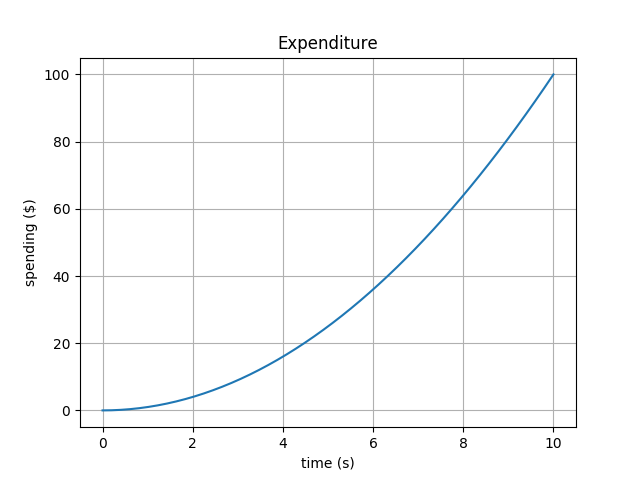

<div align="center"><b>&#1576;&#1587;&#1605; &#1575;&#1604;&#1604;&#1607; &#1575;&#1604;&#1585;&#1581;&#1605;&#1606; &#1575;&#1604;&#1585;&#1581;&#1610;&#1605;</b></div>
<div align="center">In the name of Allah, the Most Compassionate, the Most Merciful</div>

# Unity DGMS

[](https://www.npmjs.com/package/dgms)
[](https://www.npmjs.com/package/dgms)
[](https://hub.docker.com/r/dgms/dgms)

**Unity DGMS** is an open-source JSONiq analytics run-time environment for building model-driven decision guidance applications.

* **Website (and documentation):** <https://www.dgms.io/>
* **Source:** <https://github.com/nachawati/unity>
* **Bug reports:** <https://github.com/nachawati/unity/issues>

## Installation

The primary way to install **Unity DGMS** is through the pre-built Docker image ``dgms/dgms`` that is hosted on [DockerHub](https://hub.docker.com/r/dgms/dgms). To simplify the use of the Docker image with local files, it is recommended to install the ``dgms`` package from the [npm registry](https://www.npmjs.com/package/dgms), which adds the system command ``dgms`` for running **Unity DGMS** from the terminal.

### Prerequisites

Please make sure that you have Docker and Node.js installed on your system.

* Download [Docker](https://www.docker.com/get-started)
* Download [Node.js](https://nodejs.org)

### Installing **Unity DGMS**

You can install **Unity DGMS** using the Node.js package manager ``npm`` or ``yarn``:

```bash
npm install dgms --global
```

You can test the installation by running:

```bash
dgms run --query 1+1
```

If successful, this should write ``2`` to the standard output.

### Non-free solvers

The pre-built Docker image provides a variety of open source solvers for LP, MILP, NLP, MINLP problems, as well as a large number metaheuristic algorithms for black-box, multi-objective and stochastic optimization. If these solvers do not fit your needs, **Unity DGMS** also supports a large number of non-free solvers via CasADi and Pyomo.

To use additional solvers with **Unity DGMS**, simply add the path of the directory containing the solver binaries to the ``DGMS_BIN`` environmental variable. If a solver depends on any shared libraries, also add the path of the directory containing those shared libraries to the ``DGMS_LIB`` environmental variable.

## Basic usage

### Compact queries

Compact queries can be run directly from the terminal using the ``dgms run`` command, for example:

```bash
dgms run --query let $input := { text: "Hello World" } return $input.text
```

This should write ``Hello World`` to the standard output.

### Jupyter console, notebook and lab

**Unity DGMS** integrates with Project Jupyter to provide out-of-the-box support for interactive computing with JSONiq.

To start a Jupyter console session with **Unity DGMS**, run the following command from the terminal:

```bash
dgms console
```

To start a Jupyter notebook session with **Unity DGMS**, run the following command from the terminal:
```bash
dgms notebook
```

To start a Jupyter lab session with **Unity DGMS**, run the following command from the terminal:
```bash
dgms lab
```

### Running script and query modules on the command line

Files containing longer scripts and queries can also be run from the terminal using the ``dgms run`` command. For example, to run the module ``expenditure.jq``:

```xquery
jsoniq version "1.0-dg";

import module namespace n =   "http://dgms.io/modules/numerics";
import module namespace plt = "http://dgms.io/modules/plot";

variable $t := n:linspace(0, 10);
variable $c := n:square($t);

variable $ax = plt:subplot();

$ax.plot(t, c);
$ax.set({xlabel: "time (s)", ylabel: "spending ($)", title: "Expenditure"});
$ax.grid();

plt:show();
```

from the terminal, navigate to the directory containing the ``expenditure.jq`` file and run the following command:

```bash
dgms run expenditure.jq
```

This should generate the plot shown below:



### Package and dependency management

**Unity DGMS** adopts the CommonJS package format for the modular development, configuration, and distribution of DG applications and libraries, which can then be published to or installed from the [npm registry](https://www.npmjs.com/) or any Git repository.

To initialize a new package for **Unity DGMS**, simply use ``npm init`` or ``yarn init``

1. From the terminal, set the current working directory to the directory that will serve as the root directory of the package. 

    ```bash
    cd /path/to/package
    ```

2. Run the following command:

    ```bash
    npm init
    ```

This will generate a ``package.json`` file in the root directory of the package, similar to the following:

```json
{
    "name": "<name>",
    "version": "<version>",
    "description": "<description>",
    "main": "<main>",
    "scripts": {
        "test": "echo \"Error: no test specified\" && exit 1"
    },
    "author": "<author>",
    "license": "<license>"
}
```

To install a dependency from the npm registry, in the root directory of the package, run the following command, replacing ``<dependency>`` with the name of the dependency from the npm registry to install:

```bash
npm install <dependency>
```

To publish a package to the npm registry, run the following command from the root directory of the package:

```bash
npm publish
```

### Namespace resolution

**Unity DGMS** resolves references to external JSONiq modules and JSON documents within a single package based on the standard [Zorba URI resolution scheme](http://www.zorba.io/documentation/3.0/zorba/architecture/uriresolvers). For example, the following URL:

```
http://dgms.io/modules/mymodule
```

is transformed into the package-relative path: 

```
lib/io/dgms/modules/mymodule.jq
```

If no file exists at that location in the main package, **Unity DGMS** will systematically look for a file that matches the package-relative path in the closure of all dependencies of the main package.

## Compile from source

A clean build of **Unity DGMS** is performed in two steps:

**Step 1:** Clean project and build dependencies

```bash
./mvnw clean install -P linux-gcc-amd64-dependencies
```

**Step 2:** Build project

```bash
./mvnw install
```

This will build a binary distribution of **Unity DGMS** with all core dependencies inside the ``./target/unity/linux-gcc-amd64`` folder. You can test the build by running:

```bash
cd ./target/unity/linux-gcc-amd64
java -Xrs -Xms1024m -jar ./lib/unity-cli-<VERSION>.jar run 1+1
```

## Citing

If you find **Unity DGMS** useful in your work, please cite our ICEIS 2017 paper: "*Unity Decision Guidance Management System: Analytics Engine and Reusable Model Repository*" ([pdf](http://www.scitepress.org/Papers/2017/63387/63387.pdf)):

```
@inproceedings{NachawatiBrodskyLuo2017,
    author = {Mohamad Omar Nachawati and Alexander Brodsky and Juan Luo},
    title = {Unity Decision Guidance Management System: Analytics Engine and Reusable Model Repository},
    booktitle = {Proceedings of the 19th International Conference on Enterprise Information Systems (ICEIS 2017)},
    volume = {1},
    pages = {312-323},
    year = {2017},
    doi = {10.5220/0006338703120323},
}
```
