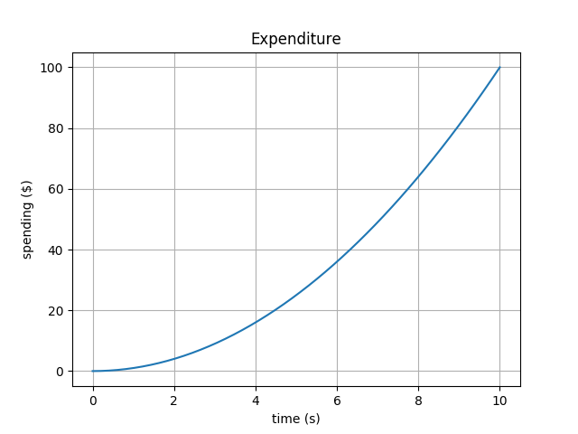

Quick Start
===========

This quick start will walk you through the core capabilities of Unity DGMS.

Compact queries
---------------

Compact queries can be run directly from the terminal using the
``dgms run`` command, for example:

.. code:: bash

   dgms run --query let $input := { text: "Hello World" } return $input.text

This should write ``Hello World`` to the standard output.

Jupyter console, notebook and lab
---------------------------------

**Unity DGMS** integrates with Project Jupyter to provide out-of-the-box
support for interactive computing with JSONiq.

To start a Jupyter console session with **Unity DGMS**, run the
following command from the terminal:

.. code:: bash

   dgms console

To start a Jupyter notebook session with **Unity DGMS**, run the
following command from the terminal:

.. code:: bash

   dgms notebook

To start a Jupyter lab session with **Unity DGMS**, run the following
command from the terminal:

.. code:: bash

   dgms lab

Running script and query modules on the command line
----------------------------------------------------

Files containing longer scripts and queries can also be run from the
terminal using the ``dgms run`` command. For example, to run the module
``expenditure.jq``:

.. code:: xquery

   jsoniq version "1.0";

   import module namespace n =   "http://dgms.io/modules/numerics";
   import module namespace plt = "http://dgms.io/modules/plot";

   variable $t := n:linspace(0, 10);
   variable $c := n:square($t);

   variable $ax = plt:subplot();

   $ax.plot(t, c);
   $ax.set({xlabel: "time (s)", ylabel: "spending ($)", title: "Expenditure"});
   $ax.grid();

   plt:show();

from the terminal, navigate to the directory containing the
``expenditure.jq`` file and run the following command:

.. code:: bash

   dgms run expenditure.jq

This should generate the plot shown below:

   Expenditure

Optimization
------------

The following file ``optimization.jq`` shows how **Unity DGMS** can be
used for optimization:

.. code:: xquery

   jsoniq version "1.0";

   import module namespace a = "http://dgms.io/modules/analytics";

   declare function local:model($input)
   {
       variable $x := $input.x;
       variable $y := $input.y;
       
       let $cost := 10 * $x + 15 * $y

       return {
           cost: $cost,
           constraints: [
               $x div 40 + $y div 30 <= 40,
               0 <= $x, $x <= 1000,
               0 <= $y, $y <= 860
           }
       }
   };

   let $input := {
       x: a:variable(200, "x", { bounds: [175, 250], domain: "integer" }),
       y: a:variable(100, "y", { bounds: [50, 400], domain: "integer" }),
   }

   return a:maximize({
       model: local:model#1,
       input: $input,
       objectives: function($output) {
           $output.cost
       },
       constraints: function($output) {
           $output.constraints
       },
       options: {
       	   solver: "cbc"
       }
   })

To optimize, run the following command in the directory containing
``optimization.jq``:

.. code:: bash

   dgms run optimization.jq -r result.json

This should write the following to the file ``result.json``:

.. code:: json

   {
       "x": 175,
       "y": 50
   }
